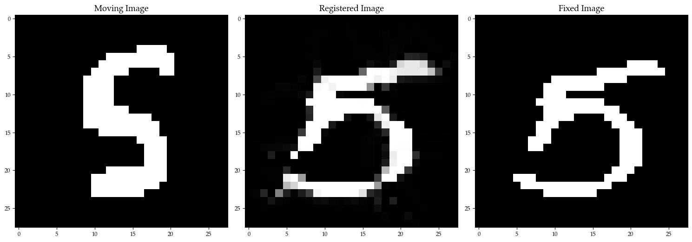
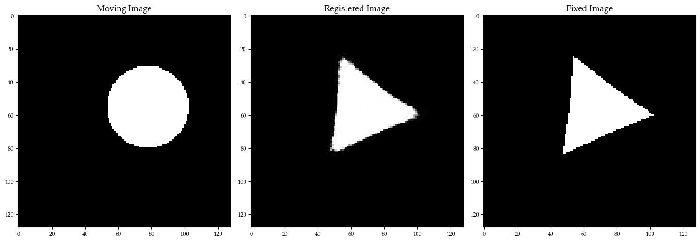
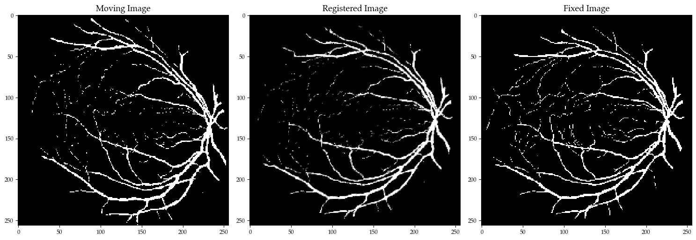

<h1 align="center">Comparison of Medical Image Registration Methods for Automated Medical Practitioner's Assistance</h1>

<i>The code implementation of Bachelor Thesis completed by Anastasiia Havryliv under the supervision of Ostap Viniavskyi.</i>

## Table of contents
* [Abstract](#abstract)
* [Setup](#setup)
* [Repository structure](#repostructure)
* [Results](#results)
* [References](#references)

## Abstract
Image registration is an essential area of research in computer vision, especially medical image registration, which can find many applications in the healthcare domain. Accurate alignment of medical data has the prospect of becoming an extremely useful tool to assist medical practitioners in determining the correct diagnosis, planning treatments, and monitoring diseases from a long-term perspective. The aim of this study is to present a comparative evaluation of the performance of the various methods for medical image registration that cover the main areas of existing algorithms' types, including both iterative and learning-based approaches. The exploration of algorithms' performance metrics, main advantages, and downsides allows us to understand the possibilities of using the chosen methods for the task, which provides insights for the utilization and advancement of existing image registration techniques in clinical practice.

## Setup

To review and run project files locally, consider following steps:

1. `git clone https://github.com/be-unkind/comparison-of-medical-image-registration-methods.git`
2. `pip install -r requirements.txt`

If you have further problems with required libraries that are not specified in the `requirements.txt` file, refer to the installation guides of that libraries.

Also, you may need to change the paths considering your local folder structure.

## Repository structure

- [data](data) - Data folder

This folder contains the folders with used datasets and their splits, used for training and validation. Here you can also find sample code for synthetic data generation in `generate_synthetic_data.ipynb` and `drive_data_aurmentation` subdirectory where you can find code for generation of synthetic generation of transformed DRIVE data samples.

- [bspline](bspline) - B-Spline Alignment

This directory contains three separate subdirectories for each of the three datasets. Each folder contains Jupyter notebooks with the optimization of method on the corresponding dataset.

- [diffeomorphic_demons](diffeomorphic_demons) - Diffeomorphic demons

This folder contains two subdirectories:

`predictions`, where each subdirectory contains predictions and metrics for each of the datasets.

`src`, where optimization scripts and Jupyter notebook files are located. (Correspondence of file to the dataset can be detected by matching of file and dataset name)

- [optical_flow](optical_flow) - Optical flow with TV-L1

In this directory you can find three separate subdirectories corresponding to each of the three datasets. Each subdirectory contains Jupyter notebook file, `metrics.csv` file with recorded metrics and `registered.pkl` file with registered images.

- [voxelmorph](voxelmorph) - GAN with VoxelMorph generator and custom discriminator

This directory contains VoxelMorph scripts and Jupyter notebooks with training of the GAN for each dataset (with dataset name - filename correspondence). Subdirectories `mnist`, `drive` and `triangles` contain model checkpoints, metrics and registered images for the corresponding datasets.

## Results

Following tables show metrics for each of the datasets. We have also provided samples of registration using different methods. Sample registration resuls fof all the methods on the three datasets can be found [here](plots)

<u><b>MNIST</b></u>

| Methods | MSE | Dice (%) | Inference time |
| - | - | - | - |
| Diffeomorphic demons | 0.02 | 89.12 | 889.00 |
| Optical flow with TV-L1 | 0.13 | 79.17 | 65.90 |
| B-Spline alignment | 0.05 | 73.33 | 21.77 |
| GAN with VoxelMorph generator and custom discriminator | 0.05 | 78.69 | 5.57 |

<u><b>Diffeomorphic demons registration</b></u>

---

<u><b>Synthetic dataset of triangles and circles</b></u>

| Methods | MSE | Dice (%) | Inference time |
| - | - | - | - |
| Diffeomorphic demons | 0.04 | 87.28 | 487.50 |
| Optical flow with TV-L1 | 0.18 | 93.44 | 355.63 |
| B-Spline alignment | 0.004 | 97.85 | 335.89 |
| GAN with VoxelMorph generator and custom discriminator | 0.14 | 61.29 | 8.30 |

<u><b>B-spline Alignment registration</b></u>

---

<u><b>DRIVE</b></u>

| Methods | MSE | Dice (%) | Inference time |
| - | - | - | - |
| Diffeomorphic demons | 0.04 | 72.44 | 264.61 |
| Optical flow with TV-L1 | 0.08 | 87.18 | 546.79 |
| B-Spline alignment | 0.07 | 52.05 | 1362.06 |
| GAN with VoxelMorph generator and custom discriminator | 0.05 | 64.17 | 16.40 |

<u><b>Optical flow with TV-L1 registration</b></u>

## References

Some parts of the code were adapted or implemented using methods from following resources:
- [Diffeomorphic demons implementation](https://github.com/xzluo97/Diffeomorphic-demons)
- [SimpleITK Python Library for B-Spline Alignment](https://github.com/SimpleITK/SimpleITK)
- [Scikit-image Python Library for Optical flow Registration](https://github.com/scikit-image/scikit-image)
- [Registration with GANs](https://github.com/gqwang1001/RegistrationWithGANs)
- [Elastic transform for data augmentation](https://www.kaggle.com/code/bguberfain/elastic-transform-for-data-augmentation)
- [Generation of synthetic data](https://github.com/uncbiag/ICON)